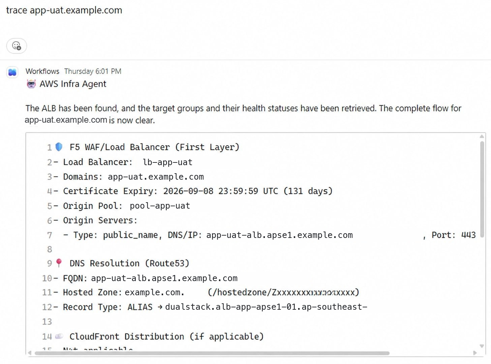
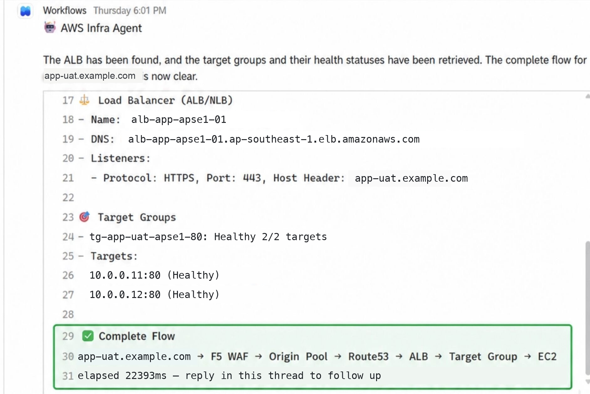
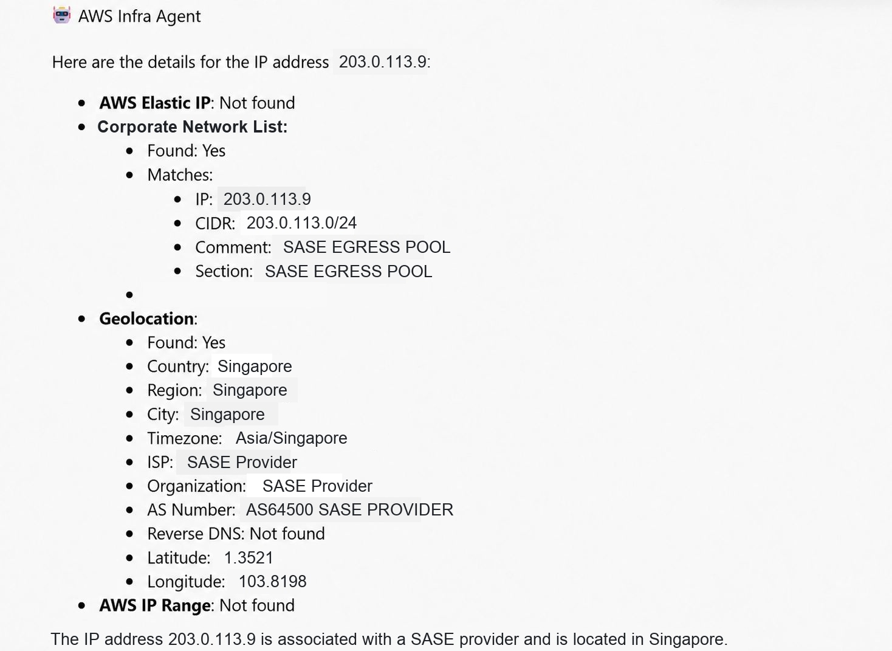
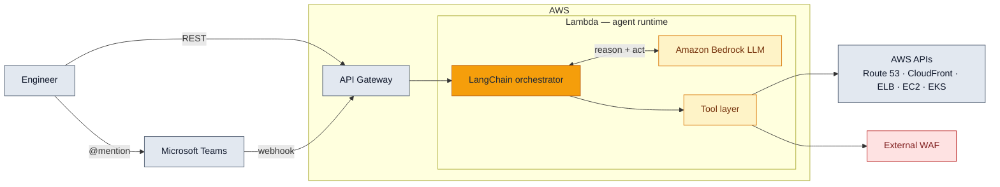
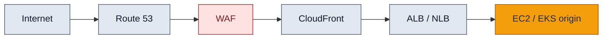

# AWS Network-Ops Agent

> A natural-language AWS network-operations agent — ask a plain-English question, get an end-to-end trace across your edge-to-origin path. Built on **Amazon Bedrock + LangChain**, deployed **serverless (Lambda + API Gateway)**, and callable straight from **Microsoft Teams**.


---

## Overview

Tracing a request path on AWS usually means jumping between Route 53, CloudFront, the WAF, load balancers and target groups — one console tab at a time. This agent collapses that into a conversation.

Ask *"trace `app.example.com`"* and it plans a sequence of read-only tool calls, walks the request path **from the edge to the origin**, and reports what it found at each hop — WAF and origin pool, DNS records, the load balancer, its listener rules and target health. Ask about an IP and it tells you which AWS resource it belongs to, whether it matches your corporate egress allowlist, and where it geolocates. Anything else that is a plain `describe`/`list` goes through a whitelisted read-only AWS CLI tool.

It runs as a Lambda behind API Gateway and can be driven over REST **or** by `@mention` in a Microsoft Teams channel.

**Scope — what it does not do.** It *maps and reports* the path; it does not diagnose **why** a target is unreachable (no security-group, NACL or route-table analysis, and no active connectivity probing).

## Key features

- **Edge-to-origin FQDN tracing** — resolves a hostname through WAF → Route 53 → CloudFront → ALB/NLB → EC2/EKS origin and reports what it found at each hop.
- **IP investigation** — maps an IP to its AWS resource, checks it against a corporate egress allowlist, and adds geolocation.
- **Self-composing AWS CLI tool** — the LLM builds its own AWS CLI commands behind a read-only operation whitelist, reaching EC2/EKS/RDS/etc. without a bespoke tool per service.
- **Multi-account** — assumes read-only cross-account roles via AWS SSO.
- **Microsoft Teams chat** — driven by `@mention` in a channel, with per-conversation context.
- **Production-grade internals** — per-call caching, retries, input validation, structured logging, and a unit + property-based (hypothesis) test suite.

## Example

Ask in a Teams channel and the agent traces the path hop by hop — starting at the WAF and DNS:



…then the load balancer, target health, and the end-to-end flow it reconstructed:



It also investigates an IP — matching it against your corporate egress allowlist and geolocating it:



<sub>Real output from a live deployment. Hostnames, IPs, account and resource names have been replaced with documentation-range examples.</sub>

## Architecture

**System — request lifecycle**



**The edge-to-origin path the agent traces**



## How the agent reasons

- **Tool selection is LLM-driven but constrained.** The system prompt encodes a mandatory FQDN-tracing workflow and anti-hallucination rules ("only report what a tool returned").
- **The generic AWS CLI tool** lets the model assemble its own commands, but every command is checked against a whitelist that blocks any mutating (`create/put/delete/modify/...`) operation — the agent is **read-only by construction**.
Design write-ups: [agent logic](docs/agent-logic.md) · [the whitelist-guarded CLI tool](docs/aws-cli-tool-design.md) · [tool selection](docs/tool-selection.md)

- **Every tool call** goes through a shared executor that adds caching, retries, and input validation, so a flaky API or a malformed argument degrades gracefully instead of derailing the run.

## Tool layer

| Tool | AWS service / target | Answers |
|---|---|---|
| `aws_cli_tool` | any AWS service (whitelisted, read-only) | "describe / list …" that has no dedicated tool |
| `route53_tool` | Route 53 | DNS records, hosted zones, resolution |
| `cloudfront_tool` | CloudFront | distributions, origins, behaviors |
| `elb_tool` | ALB / NLB / ELB | listeners, rules, target health |
| `ip_lookup_tool` | EC2 EIP + allowlist + geo | which resource / egress an IP belongs to |
| `f5_waf_tool` | external WAF (Distributed Cloud) | LB / origin-pool / WAF policy lookups |


## Tech stack

**Python 3.9+** · **LangChain** on **Amazon Bedrock** · AWS **Lambda, API Gateway, Route 53, CloudFront, ELB, DynamoDB, CloudWatch, IAM/SSO** · **CloudFormation / Terraform** IaC · **Pydantic v2** · **pytest + hypothesis + moto** · integration: **Microsoft Teams**.

## Getting started

```bash
git clone https://github.com/grey-techstack/aws-network-ops-agent.git
cd aws-network-ops-agent
python -m venv .venv && source .venv/bin/activate
pip install -r requirements.txt

cp .env.example .env          # then edit — see Configuration
pytest -m unit                # run the offline test suite (no AWS needed)
```

## Configuration

Everything environment-specific is set in `.env` (see `.env.example`) or `config.example.yaml` — **no account, domain, or endpoint is hardcoded**. Point it at *your* environment:

| Key | What to set it to |
|---|---|
| `AWS_REGION` | your region, e.g. `ap-southeast-1` |
| `AWS_ACCOUNT_IDS` | the account id(s) the agent may read (comma-separated) |
| `BEDROCK_MODEL_ID` | the Bedrock model to use |
| `HOSTED_DOMAINS` | the domains the agent should recognize as "yours" |
| `WAF_PROVIDER` / `WAF_BASE_URL` | external WAF integration (leave blank to disable) |
| `NETWORK_ALLOWLIST_PATH` | path to your egress allowlist (`src/corporate-network-whitelist.tf` template provided) |
| `API_GATEWAY_URL` / `TEAMS_INCOMING_WEBHOOK_URL` | only for the Teams integration |

Credentials come from your standard AWS chain (env / SSO / role) — the agent never stores keys.

## Deployment

Deploy the Lambda + API Gateway with the provided **CloudFormation** or **Terraform** templates in `deployment/` — see the [deployment guide](docs/deployment.md). Grant the function a **read-only** IAM role (the tool whitelist enforces read-only at the app layer too — defense in depth).

## Integrations

- **Microsoft Teams** — an outgoing-webhook handler responds to `@mention`s and keeps per-conversation context. See the [Teams integration design](docs/teams-integration.md).

## Testing

```bash
pytest -m unit          # fast, mocked (moto) — no AWS
pytest -m property      # property-based (hypothesis)
pytest -m integration   # needs AWS credentials
```

## Security & design notes

- **Read-only by construction** — mutating AWS operations are blocked by the CLI whitelist; deployment uses a read-only IAM role.
- **No secrets in the repo** — all credentials/endpoints are supplied via environment/SSO at runtime.
- The bundled `src/corporate-network-whitelist.tf` ships **example** CIDRs only — replace with your own.

## License

[MIT](./LICENSE)
